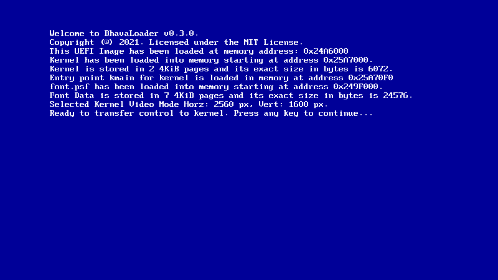
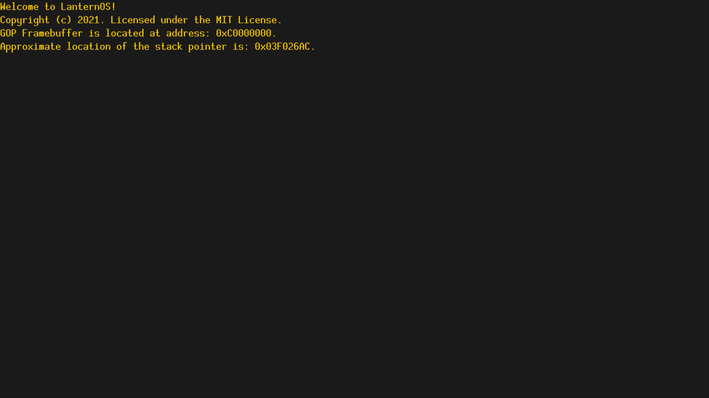

# LanternOS

# Building

Currently you can only build on linux. Currently only for x86_64 architectures.

You will need:

* Python 3.6 or higher
* CMake 3.16.0 or higher
* The build depencies required for compiling gcc: https://wiki.osdev.org/GCC_Cross-Compiler#Installing_Dependencies
* Qemu is used by default for running in a VM.
* A copy of the full mingw headers. On Debian this can be obtained via installing the "mingw-w64-x86-64-dev" package.

1. Run scripts/install-toolchain.py. By default it will install into $HOME/opt/LanternOS-toolchain.
You can specify a different install directory with --installpath.
2. Run build.py. You will need to pass the include directory for the mingw c headers with --mingw-headers. By default this script will look for the cross-compilers in $HOME/opt/LanternOS-toolchain. If you specified a custom install directory, you will need to provide the full path to them to the script.
3. You must provide a PC Screen Font (.psf) Version 2 file at Vendor/font/font.psf. The glyphs must be 10 pixels wide. A font is not currently supplied due to licensing.